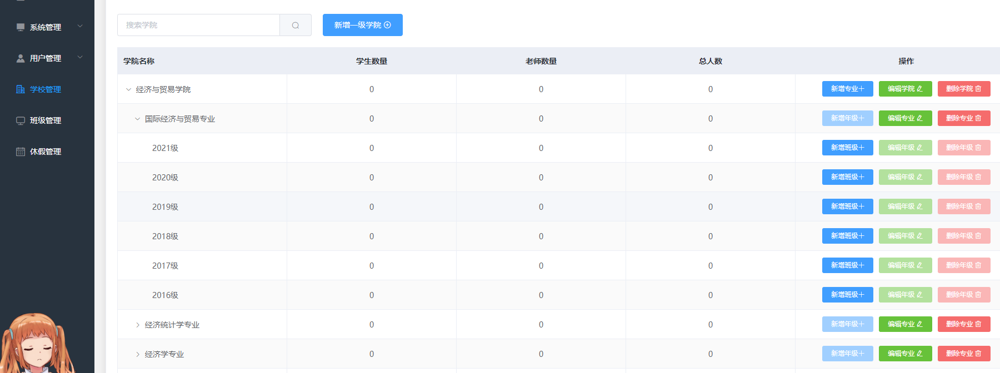
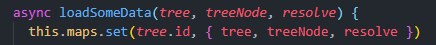

## elementUi table懒加载子节点修改数据后局部更新数据

分享一下我的做法，希望对你有帮助~ 我的个人博客 : www.dddhl.cn

### 1.我的问题

先说一下我的 table 表格

elementUi 的 table 懒加载，总共有四个层级，学院下有专业，专业下有年级，年级下有班级。每次展开层级会根据上一层父节点的id请求新的数据。最近发现更新子节点数据后，页面不更新。



### 2.我的解决方案

每次更改数据后，更新对应子节点就可以了。重新调用懒加载函数即可

### （1）在data声明一个变量 maps 

因为懒加载的参数有点特殊，而我刚好可以用id来区分，所以用map来记录

```js
data() {
    return {
      maps: new Map()  // 用来记录懒加载函数的参数
    }
}
```

### （2）在懒加载函数记录每次请求的参数

`loadSomeData` 是我的懒加载函数

tree.id 是我用来请求子节点数据的参数



```js
this.maps.set(tree.id, { tree, treeNode, resolve })
```

### （3）在更新子节点数据后重新调用懒加载函数

修改数据的函数里我能获得`id`，所以在请求完的回调里根据`id`取出对应层级所需的懒加载参数，直接调用即可重新获取数据更新。

```js
const { tree, treeNode, resolve } = this.maps.get(id)
this.loadSomeData(tree, treeNode, resolve)
```


